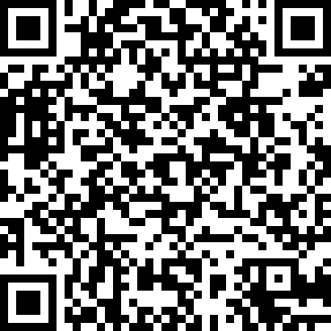

# QRCode

[](https://semaphoreci.com/s-m-i-t-a/qr_code)


This library is useful for generating QR code to your projects.



## Installation
```elixir
def deps do
  [
    {:qr_code, "~> 2.1.1"}
  ]
end
```


## Usage
If you want to create QR code, just use the function `QRCode.create(orig, level)`:
```elixir
  iex> QRCode.create("Hello World")
  {:ok, %QRCode.QR{...}}
```

You can also change the error correction level according to your needs. There are four level of error corrections:
```elixir
  | Error Correction Level    | Error Correction Capability    |
  |---------------------------|--------------------------------|
  | :low (default value)      | recovers 7% of data            |
  | :medium                   | recovers 15% of data           |
  | :quartile                 | recovers 25% of data           |
  | :high                     | recovers 30% of data           |
```
> Be aware higher levels of error correction require more bytes, so the higher the error correction level,
the larger the QR code will have to be.

We've just generated QR code and now we want to save it to some image file format with high quality. We can do
that by using `QRCode.Svg.save_as/3` function:
```elixir
  iex> "Hello World"
        |> QRCode.create(:high)
        |> Result.and_then(&QRCode.Svg.save_as(&1,"/path/to/hello.svg"))
  {:ok, "/path/to/hello.svg"}
```

where we used an error correction level `:high` and our library [Result](https://hexdocs.pm/result/api-reference.html).
As you can see the svg file will be saved into `/path/to/` directory.

Also there are a few settings for svg:
```elixir
  | Setting          | Type                | Default value | Description             |
  |------------------|---------------------|---------------|-------------------------|
  | scale            | positive integer    | 10            | scale for svg QR code   |
  | background_color | string or {r, g, b} | "#ffffff"     | background color of svg |
  | qrcode_color     | string or {r, g, b} | "#000000"     | color of QR code        |
  | format           | :none or :indent    | :none         | indentation of elements |
```

By this option, you can set the size QR code, background of QR code or QR code colors. The
format option is for removing indentation (of elements like is `<rect.. />`) in a svg file.
It means that for value `:none`, the svg file contains only one "line of code" (no indentation), whereas for `:indent` svg file has a structure and svg code is more readable.

Let's see an example below:
```elixir
  iex> settings = %QRCode.SvgSettings{qrcode_color: {17, 170, 136}}
  iex> "your_string"
        |> QRCode.create()
        |> Result.and_then(&QRCode.Svg.save_as(&1,"/tmp/your_name.svg", settings))
  {:ok, "/tmp/your_name.svg"}
```


## Limitations
The QR code is limited by characters that can contain it:
```elixir
  | Encoding Mode | Maximum number of characters |
  |---------------|------------------------------|
  | Numeric       | 7089 characters              |
  | Alphanumeric  | 4296 characters              |
  | Byte          | 2953 characters              |
  | Kanji         | 1817 characters              |
```
In our case this library was developed only for `Byte` mode. If anyone needs the rest of encoding modes,
please open new issue or push your code in this repository.

## Notes
* If you need a png format instead of svg, you can use [mogrify](https://github.com/route/mogrify) to convert it:
  ```elixir
  import Mogrify

  "qr_code.svg"
    |> Mogrify.open()
    |> format("png")
    |> save(path: "qr_code.png")
  ```

* You can also save the QR matrix to csv using by [csvlixir](https://github.com/jimm/csvlixir):
  ```elixir
  {:ok, qr} = QRCode.create("Hello World")
  save_csv(qr.matrix, "qr_matrix.csv")

  def save_csv(matrix, name_file) do
    name_file
    |> File.open([:write], fn file ->
      matrix
      |> CSVLixir.write()
      |> Enum.each(&IO.write(file, &1))
    end)
  end
  ```

## References
* [http://www.thonky.com/qr-code-tutorial/](http://www.thonky.com/qr-code-tutorial/)


## License

QRCode source code is licensed under the _BSD-4-Clause._

----
Created:  2018-11-24Z
